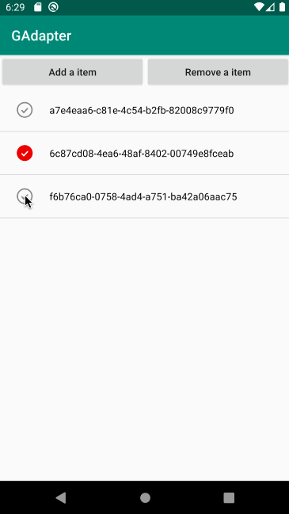
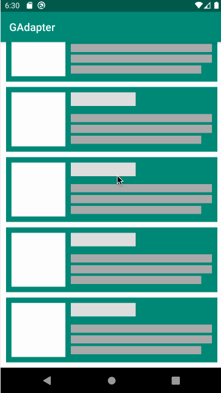
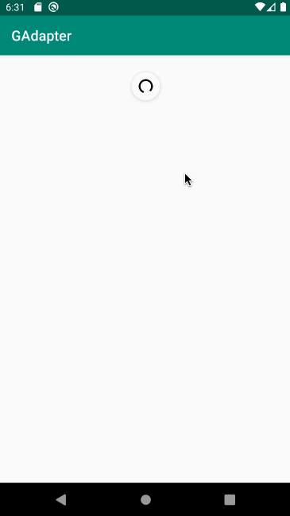

# GAdapter

[](https://jitpack.io/#ITGungnir/GAdapter)


## Common, easy-to-use adapter for RecyclerViews.

`GAdapter`是一个为`RecyclerView`设计的简单通用的`Adapter`，它通过指令式的方式配置`ViewHolder`和绑定数据，使`ViewHolder`的可复用性大大提高。

`GAdapter`是对`RecyclerView.Adapter`、`RecyclerView.ViewHolder`、`DiffUtil`等组件的封装，主要针对以下方面：
* 将`ViewHolder`与`RecyclerView.Adapter`解耦，提高`ViewHolder`的可复用性；
* 利用`DiffUtil`的`diff`算法，计算最小改动路径，避免使用`notifyDataSetChanged()`方法重绘整个`RecyclerView`，也避免使用`notifyItemInserted()`等方法带来的额外人工计算成本和风险；
* 重写`RecyclerView.Adapter`中三个参数的`onBindViewHolder()`方法，通过`payloads`的方式实现局部刷新；
* 借助`Kotlin`语言的函数式特性，使代码更简洁、更优雅；
* 在`v1.1.0`版本之后加入了对`LoadMore`的支持。





## 1、配置
#### 1）在工程根目录下的`build.gradle`文件中添加仓库依赖：
```groovy
buildscript {
    // ... Your codes
    repositories {
        // ... Your codes
        maven { url 'https://jitpack.io' }
    }
}
```

#### 2）在模块下的`build.gradle`文件中添加`GAdapter`的依赖：
```groovy
dependencies {
    // ... Your codes
    implementation "com.github.ITGungnir:GAdapter:$adapter_version"
}
```

## 2、概念解释
`GAdapter`框架中使用了`Delegate`和`ListItem`来分别对视图和数据进行了代理。

#### 1）`Delegate`
`Delegate`是对视图的代理，负责`RecyclerView`中每个`item`的渲染和数据的绑定。`Delegate`接口中包含三个方法：
* `layoutId()`：配置这个`item`的视图文件ID，如`R.id.xxx`；
* `onCreateViewHolder(parent)`：代理了`RecyclerView.Adapter`的`onCreateViewHolder()`方法，负责创建`item`的视图；
* `onBindViewHolder(holder, data, payloads)`：代理了`RecyclerView.Adapter`的两个参数和三个参数的`onBindViewHolder()`方法，负责向`item`视图中的各个控件中注入数据。

本框架中默认实现了`BaseDelegate`类，提供了简单的`onCreateViewHolder()`方法的实现，并具体化出了`onRender(holder, data, payloads)`方法用于绑定数据。

#### 2）`ListItem`
`ListItem`是对数据的代理，负责存储`RecyclerView`中每个`item`中数据的存储与比较。`ListItem`接口中包含三个方法：
* `isItemSameTo(oldItem)`：代理了`DiffUtil.ItemCallback`接口的`areItemsTheSame(oldItem, newItem)`方法，用来比较两条数据是否是同一条，在这个方法中通常通过比较数据的`id`等可以唯一标识这条数据的字段进行比较，当判定这两条数据相同时，则底层不会再调用`notifyItemXXX()`方法进行`item`的增删；
* `isContentSameTo(oldItem)`：代理了`DiffUtil.ItemCallback`接口的`areContentsTheSame(oldItem, newItem)`方法，用来判断是否需要局部刷新。只有当`areItemsTheSame(oldItem, newItem)`方法返回`true`时，才会走这个方法，在这个方法中通常通过比较一些细节性的字段，如是否被选中、倒计时等，如果这些决定局部刷新的字段全都相同，则判定为两条数据完全相同；
* `getChangePayload(oldItem)`：代理了`DiffUtil.ItemCallback`接口的`getChangePayload(oldItem, newItem)`方法，用来生成数据更新的负载`payload`。只有当`areItemsTheSame(oldItem, newItem)`方法返回`true`、`areContentsTheSame(oldItem, newItem)`方法返回`false`时，才会走这个方法。在这个方法中将新数据相比于旧数据的变更之处存储到一个`Bundle`对象中，并在`Delegate`的`onBindViewHolder(holder, data, payloads)`方法中回调。

本框架中默认实现了`ImmutableListItem`接口，如果列表中的数据确认不会进行刷新，则可以实现这个接口，以减少不必要的代码量。

#### 3）`BindMap`
`BindMap`是`ListItem`和`Delegate`之间的桥梁，其中包含三个属性：
* `type`：即`item`在`RecyclerView.Adapter`中的`viewType`；
* `isViewForType`：是一个`(ListItem) -> Boolean`的`Lambda`表达式，判断当前的`ListItem`是否符合第三个参数的`Delegate`的条件；
* `delegate`：`Delegate`对象，即代理该条数据的视图对象。

## 3、多种场景下的使用方式
#### 1）不需要刷新的场景
创建一个实体类实现`ImmutableListItem`接口：
```kotlin
/**
 * 不需要刷新的数据可以直接实现ImmutableListItem接口
 */
data class SimpleListItem(val content: String) : ImmutableListItem
```
创建一个`BaseDelegate`的子类：
```kotlin
class SimpleDelegate : BaseDelegate<SimpleListItem>() {

    override fun layoutId(): Int = R.layout.item_simple

    override fun onRender(holder: VH, data: SimpleListItem, payloads: MutableList<Bundle?>) {
        holder.itemView.tv_content.apply {
            text = data.content
            setOnClickListener {
                Toast.makeText(context, data.content, Toast.LENGTH_SHORT).show()
            }
        }
    }
}
```
初始化`GAdapter`并绑定数据：
```kotlin
// 通过RecyclerView的扩展函数getGAdapter()来获取一个GAdapter的实例
val listAdapter = list.getGAdapter()
    // 通过addDelegate()方法为RecyclerView添加一个viewType，
    // 第一个参数是一个Lambda表达式，用于提供ListItem的筛选条件；
    // 第二个参数是一个Delegate对象，
    // 即符合第一个参数中的筛选条件的ListItem就使用第二个参数中的Delegate进行渲染
    .addDelegate({ it is SimpleListItem }, SimpleDelegate())
    // 前面的代码都是对GAdapter的配置，最后需要将这个GAdapter绑定到RecyclerView上
    .initialize()

val dataList = mutableListOf<ListItem>()
for (i in 1..30) {
    dataList.add(SimpleListItem("List item $i"))
}

// 通过refresh()方法刷新列表
listAdapter.refresh(dataList)
```

#### 2）需要刷新或局部刷新的场景
由于需要刷新或局部刷新，因此创建一个实体类并继承自`ListItem`接口，实现其中的三个方法来判定什么时候需要刷新：
```kotlin
/**
 * 需要局部刷新的数据需要实现ListItem接口并实现其三个方法
 *
 * DiffUtil的工作机制：
 * 存储着两个列表，分别是旧数据列表和新数据列表。当有新列表被赋值到DiffUtil上时，
 * 会通过排列组合的方式两两比较数据，具体的规则如下：
 * 1. 当areItemsTheSame()方法返回true时，表示两条数据是同一条数据，此时会进入下一步；
 * 2. 当areContentsTheSame()方法返回false时，表示两条数据虽然是同一条数据，但其细节内容
 *    并不相同，此时会进入下一步；
 * 3. getChangePayload()方法会返回新老数据之间的变化的payload，通过这个payload可以局部刷新
 */
data class PayloadsListItem(val content: String, var selected: Boolean = false) : ListItem {

    /**
     * 判断新老数据是否是同一条数据
     */
    override fun isItemSameTo(oldItem: ListItem): Boolean =
        this.content == (oldItem as PayloadsListItem).content

    /**
     * 如果新老数据是同一条数据，则判断是否需要局部刷新
     */
    override fun isContentSameTo(oldItem: ListItem): Boolean =
        this.selected == (oldItem as PayloadsListItem).selected

    /**
     * 如果需要局部刷新，则生成局部刷新的payload
     */
    override fun getChangePayload(oldItem: ListItem): Bundle? = if (isContentSameTo(oldItem)) {
        null
    } else {
        Bundle().apply { putBoolean("PL_SELECT", selected) }
    }
}
```
在`Delegate`中，需要根据`payloads`来实现局部刷新，即判断`payloads`是否为空，如为空则正常加载数据，否则根据`payloads`中的数据局部刷新页面：
```kotlin
class PayloadsDelegate(private val callback1: (Int) -> Unit) : BaseDelegate<PayloadsListItem>() {

    override fun layoutId(): Int = R.layout.item_payloads

    override fun onRender(holder: VH, data: PayloadsListItem, payloads: MutableList<Bundle?>) {
        holder.itemView.apply {
            // 如果payloads不为空，则从中取出新的局部数据，并更新局部控件，以此达到局部更新的目的，减少UI重绘，提升性能
            if (payloads.isNotEmpty()) {
                payloads[0]?.let { payload ->
                    payload.keySet().forEach { key ->
                        when (key) {
                            "PL_SELECT" -> iv_checker.setImageResource(getCheckerRes(payload.getBoolean(key)))
                        }
                    }
                }
            } else {
                // 如果payloads为空，则说明这是一条新数据，直接渲染UI即可
                iv_checker.apply {
                    setImageResource(getCheckerRes(data.selected))
                    setOnClickListener {
                        if (holder.adapterPosition == -1) {
                            return@setOnClickListener
                        }
                        callback1.invoke(holder.adapterPosition)
                    }
                }

                tv_content.apply {
                    text = data.content
                    setOnClickListener {
                        if (holder.adapterPosition == -1) {
                            return@setOnClickListener
                        }
                        Toast.makeText(context, "点击：${data.content}", Toast.LENGTH_SHORT).show()
                    }
                }
            }
        }
    }

    private fun getCheckerRes(selected: Boolean) = when (selected) {
        true -> R.drawable.svg_selected_selected
        else -> R.drawable.svg_selected_normal
    }
}
```
`GAdapter`对象的创建代码如下：
```kotlin
listAdapter = list.getGAdapter()
    // PayloadsDelegate中需要传入一个Lambda，即一个回调，在点击前面的复选框时反选这个复选框
    .addDelegate({ it is PayloadsListItem }, PayloadsDelegate { index ->
        val targetItem = dataList[index] as PayloadsListItem
        dataList[index] = targetItem.copy(selected = !targetItem.selected)
        listAdapter.refresh(dataList)
    })
    .initialize()
```

#### 3）多种`ViewType`的场景
当一个`RecyclerView`中有多种`viewType`时，只需要调用多次`addDelegate()`方法即可：
```kotlin
val listAdapter = list.getGAdapter()
    .addDelegate({ it is MultipleSearchBar }, MultipleSearchBarDelegate())
    .addDelegate({ it is MultipleBanner }, MultipleBannerDelegate())
    .addDelegate({ it is MultipleHotBar }, MultipleHotBarDelegate())
    .addDelegate({ it is MultipleData }, MultipleDataDelegate())
    .initialize()
```

#### 4）添加对`LoadMore`的支持
`GAdapter`在`v1.1.0`版本之后加入了对`LoadMore`（上拉加载更多）功能的支持。支持该功能需要做以下更改。

第一步，创建`LoadMore`对应的`Footer`的`Delegate`，此`Delegate`必须继承自`my.itgungnir.adapter.footer.FooterDelegate`。可以参考本项目`Demo`中创建的`NetworkFooterDelegate`：
```kotlin
class NetworkFooterDelegate(private val failRetry: () -> Unit) : FooterDelegate() {

    override fun layoutId(): Int = R.layout.view_list_footer

    override fun onDefault(view: View) {
        view.footer_loading.visibility = View.GONE
        view.footer_text.visibility = View.VISIBLE
        view.footer_text.text = "上拉加载更多数据"
        view.setOnClickListener(null)
    }

    override fun onLoading(view: View) {
        view.footer_loading.visibility = View.VISIBLE
        view.footer_text.visibility = View.GONE
        view.setOnClickListener(null)
    }

    override fun onNoMore(view: View) {
        view.footer_loading.visibility = View.GONE
        view.footer_text.visibility = View.VISIBLE
        view.footer_text.text = "没有更多数据了"
        view.setOnClickListener(null)
    }

    override fun onFailure(view: View) {
        view.footer_loading.visibility = View.GONE
        view.footer_text.visibility = View.VISIBLE
        view.footer_text.text = "加载失败，点击重试"
        view.setOnClickListener {
            failRetry.invoke()
        }
    }
}
```
创建的类需要实现`FooterDelegate`中的四个抽象方法：
* onDefault(view: View)：渲染Footer的默认展示样式；
* onLoading(view: View)：渲染上拉加载更多时的Loading样式；
* onNoMore(view: View)：渲染无更多数据时的Footer样式；
* onFailure(view: View)：渲染上拉加载失败时的Footer样式。

第二步，通过`addFooterDelegate()`方法为`GAdapter`添加一个`Footer`的`Delegate`：
```kotlin
listAdapter = list.getGAdapter()
    .addDelegate({ it is NetworkListItem }, NetworkDelegate())
    .addFooterDelegate(NetworkFooterDelegate {
        listAdapter.loadMoreRetry { loadMoreDataList() }
    })
    .initialize()
```

第三步，调用`RecyclerView`的扩展方法`setOnLoadMoreListener()`，设置上拉加载更多的回调：
```kotlin
setOnLoadMoreListener({ !refreshLayout.isRefreshing }) { 
    loadMoreDataList()
}
```
`setOnLoadMoreListener()`方法包含两个参数，第一个参数是一个返回`Boolean`类型的`Lambda`表达式，用于标识在什么情况下可以上拉加载，`Demo`中的代码表示在`SwipeRefreshLayout`正在刷新时
不可以进行上拉加载；第二个参数是上拉加载的回调，即具体做上拉加载操作的代码。

第四步，通过`GAdapter`提供的扩展方法刷新数据或改变`Footer`的状态。这些扩展方法包括以下几个：
* refreshWithFooter(list: MutableList<ListItem>, hasMore: Boolean)：加载数据，第一个参数是新列表，第二个参数是是否还有下一页的标识，调用这个方法后，Footer的状态将根据hasMore参数的值
被置为`IDLE`或`NO_MORE`状态；
* loadMoreError()：当需要展示Footer的错误态时可以调用这个方法，调用这个方法后，Footer的状态将被置为`FAILED`状态；
* loadMoreRetry(retry: () -> Unit)：重试，一般会在`FAILED`状态下提供用户点击重试的接口，点击重试时可以调用这个方法，调用后Footer的状态将被置为`PROGRESSING`状态。

以上几个方法的主要作用是改变`Footer`的状态，`Footer`包含如下几种状态：
* IDLE(0)：默认状态，在每一页加载完毕切判定还有更多数据时会被置为此状态；
* PROGRESSING(1)：加载状态，正在执行上拉加载请求时会被置为此状态；
* NO_MORE(2)：没有更多数据的状态，当最后一页加载完毕，判定为无更多数据时会被置为此状态；
* FAILED(3)：加载失败状态，当数据请求发生异常时会被置为此状态（需要用户自己触发）。

## Change Log
#### v1.1.2
* 优化Gradle依赖方式

#### v1.1.1
* 解决内存泄漏问题

#### v1.1.0
* 加入对LoadMore的支持

#### v1.0.1
* 此版本不支持LoadMore

## License
```text
Copyright 2019 ITGungnir

Licensed under the Apache License, Version 2.0 (the "License");
you may not use this file except in compliance with the License.
You may obtain a copy of the License at

    http://www.apache.org/licenses/LICENSE-2.0

Unless required by applicable law or agreed to in writing, software
distributed under the License is distributed on an "AS IS" BASIS,
WITHOUT WARRANTIES OR CONDITIONS OF ANY KIND, either express or implied.
See the License for the specific language governing permissions and
limitations under the License.
```
